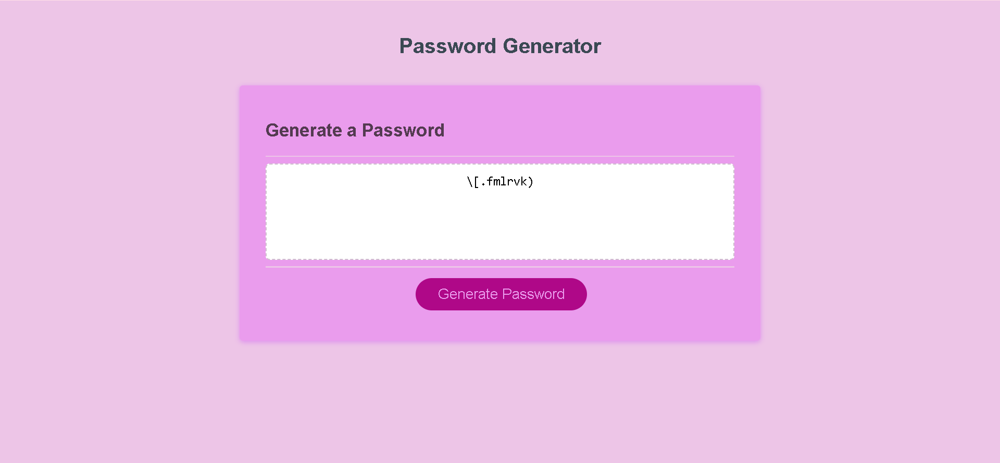

# Module 03 Challenge: Password Generator Using JavaScript

<h2>Random Password Generator</h2>

This module's Challenge requires a creation of an application that an employee can use to generate a random password based on criteria they've selected. This app will run in the browser, and will feature dynamically updated HTML and CSS powered by JavaScript code that you write. It will have a clean and polished user interface that is responsive, ensuring that it adapts to multiple screen sizes. 

<h2>User Story</h2>

AS AN employee with access to sensitive data
I WANT to randomly generate a password that meets certain criteria
SO THAT I can create a strong password that provides greater security

<h2>Acceptance Criteria</h2>

GIVEN I need a new, secure password:

<ul>
<li>WHEN I click the button to generate a password,
THEN I am presented with a series of prompts for password criteria</li>
<li>WHEN prompted for password criteria,
THEN I select which criteria to include in the password</li>
<li>WHEN prompted for the length of the password,
THEN I choose a length of at least 8 characters and no more than 128 characters</li>
<li>WHEN asked for character types to include in the password,
THEN I confirm whether or not to include lowercase, uppercase, numeric, and/or special characters</li>
<li>WHEN I answer each prompt,
THEN my input should be validated and at least one character type should be selected</li>
<li>WHEN all prompts are answered,
THEN a password is generated that matches the selected criteria</li>
<li>WHEN the password is generated,
THEN the password is either displayed in an alert or written to the page</li>
</ul>

<h2>Preview</h2>

The following animation shows the web application's appearance and functionality:

<a href="https://a-nord.github.io/Top-Secret-Password-Generator/">💖Top Secret Generator💖</a>
<a href="https://github.com/a-nord/Top-Secret-Password-Generator">💖Ashley Nord's Repository💖</a>
*SN: Starter code was given by professor. Code was helped by John Coakley (tutor) and Mary Elenius (TA)*